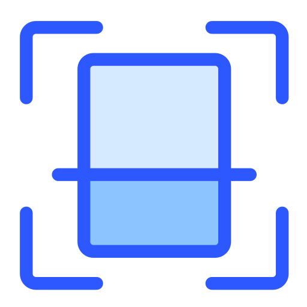

<div align="center">



# Scanova

### Numérisation intelligente des dossiers médicaux algériens par OCR embarqué

[](https://flutter.dev)
[](https://dart.dev)
[](https://developers.google.com/ml-kit)
[](https://www.sqlite.org)
[](#)
[](#)

*Projet de Fin d'Études (PFE) — Master 2 Informatique*
*Université Mouloud Mammeri de Tizi-Ouzou (UMMTO) · Stage chez Nexodia IT*

</div>

---

## Table des matières

- [Présentation](#présentation)
- [Fonctionnalités](#fonctionnalités)
- [Documents pris en charge](#documents-pris-en-charge)
- [Architecture technique](#architecture-technique)
- [Le module OCR : la reconstruction spatiale](#le-module-ocr--la-reconstruction-spatiale)
- [Modèle de données](#modèle-de-données)
- [Sécurité et contrôle d'accès (RBAC)](#sécurité-et-contrôle-daccès-rbac)
- [Pile technologique](#pile-technologique)
- [Structure du projet](#structure-du-projet)
- [Prérequis](#prérequis)
- [Installation](#installation)
- [Utilisation](#utilisation)
- [Gestion de projet](#gestion-de-projet)
- [Auteurs et encadrement](#auteurs-et-encadrement)
- [Licence](#licence)

---

## Présentation

**Scanova** est une application mobile **Flutter** conçue pour la **numérisation intelligente de documents médicaux algériens**. Elle permet à un personnel de santé de photographier un document papier (carte d'identité, carte Chifa, bilan biologique), d'en extraire automatiquement les informations structurées grâce à la reconnaissance optique de caractères (OCR), puis de les archiver dans un dossier patient consultable.

Le projet répond à une contrainte de terrain majeure : **la connectivité réseau peu fiable** dans de nombreux établissements de santé. Pour cette raison, Scanova adopte une approche **« offline-first »** : l'intégralité de la reconnaissance de texte s'effectue **localement, sur l'appareil**, sans serveur distant ni connexion Internet, via *Google ML Kit*. Les données sont stockées dans une base **SQLite** embarquée.

> L'objectif est de réduire la saisie manuelle, de fiabiliser l'archivage et de garantir la disponibilité de l'outil même hors connexion.

---

## Fonctionnalités

- **Capture et scan de documents** — prise de photo guidée (overlay de cadrage) ou import depuis la galerie, avec prétraitement de l'image.
- **OCR embarqué (on-device)** — extraction de texte hors ligne via Google ML Kit Text Recognition.
- **Extraction structurée** — analyseurs (*parsers*) dédiés à chaque type de document pour transformer le texte brut en données exploitables.
- **Gestion des dossiers patients** — création, recherche avancée et consultation des dossiers et des documents associés.
- **Export / impression PDF** — génération de documents PDF multi-pages incluant le texte reconnu.
- **Authentification et rôles** — comptes utilisateurs avec contrôle d'accès basé sur les rôles (RBAC).
- **Journal d'audit** — traçabilité des actions sensibles réalisées dans l'application.
- **Historique** — suivi des numérisations et opérations effectuées.

---

## Documents pris en charge

| Document | Description | Spécificités d'extraction |
|----------|-------------|---------------------------|
| **CNI** | Carte Nationale d'Identité algérienne | Dates au format `AAAA.MM.JJ` (année en premier, séparées par des points) |
| **Carte Chifa** | Carte d'assuré social (CNAS) | Numéro de sécurité sociale au format `XX XXXX XXXX XX` ; libellés en arabe → extraction du nom ciblée sur les lignes en alphabet latin |
| **Bilan biologique** | Compte-rendu d'analyses de laboratoire | Documents multi-colonnes nécessitant une reconstruction spatiale des lignes (voir ci-dessous) |

---

## Architecture technique

Scanova suit une organisation en **couches** claire, séparant l'interface, la logique métier et la persistance :

```
Interface (screens / widgets)
        │
        ▼
Services métier (OCR, parsers, auth, audit, impression)
        │
        ▼
Modèles (models)
        │
        ▼
Persistance locale (SQLite via sqflite)
```

- **`screens/`** — les écrans de l'application (connexion, accueil, scan, dossiers, etc.).
- **`widgets/`** — composants d'interface réutilisables (boutons, cartes, overlays, etc.).
- **`services/`** — la logique métier : service OCR, analyseurs par document, authentification, audit, impression PDF, prétraitement d'image.
- **`models/`** — les structures de données métier.
- **`database/`** — la couche d'accès à SQLite (`database_helper.dart`).
- **`theme/`** — la charte graphique de l'application.

---

## Le module OCR : la reconstruction spatiale

Le cœur technique de Scanova réside dans le traitement des **documents multi-colonnes**, en particulier les bilans biologiques.

### Le problème

Google ML Kit lit un document **par blocs visuels** et non par lignes logiques. Sur un document à plusieurs colonnes (par exemple : *Paramètre · Résultat · Valeurs de référence*), cela **désynchronise les données** : le texte d'une colonne n'est plus aligné avec celui de la colonne voisine, rendant l'interprétation impossible.

### La solution

Un algorithme de **reconstruction spatiale** (`extractStructuredText`) regroupe les lignes de texte (`TextLine`) selon leurs coordonnées :

1. **Regroupement (clustering)** des `TextLine` par coordonnée **Y** (les éléments d'une même ligne logique partagent une hauteur proche), avec une tolérance paramétrable (`_yClusteringTolerance`).
2. **Tri** des éléments de chaque groupe par coordonnée **X** (de gauche à droite).
3. **Reconstruction** des lignes logiques avant transmission aux analyseurs.

> Cette approche a fait passer le taux de détection des bilans biologiques d'environ **10 % à 60–75 %**.

### Séparation des responsabilités

- `extractStructuredText` gère **uniquement** la reconstruction spatiale du texte.
- Toute la logique d'**interprétation** réside dans les analyseurs (`BilanParser`, `CniParser`, `ChifaParser`).
- Pour un document multi-pages, le texte de toutes les pages est **concaténé puis analysé en une seule passe**, afin de préserver le contexte (par exemple l'état de catégorie d'un bilan) au passage d'une page à l'autre.

---

## Modèle de données

Les données sont persistées localement dans une base **SQLite** (via `sqflite`).

Les principales entités du modèle :

- **`User`** — comptes utilisateurs et rôles.
- **`Patient` / `PatientData`** — dossiers patients.
- **`MedicalDocument` / `DocumentPage`** — documents numérisés et leurs pages.
- **`CardScan`** — données extraites des cartes (CNI / Chifa).
- **`Bilan` / `BilanPage` / `ValeurBiologique`** — bilans biologiques et leurs valeurs.
- **`HistoryEntry`** — historique des opérations.
- **`AuditLog`** — journal d'audit (volontairement **dénormalisé**, sans clés étrangères, afin de préserver l'intégrité de la trace même si une entité liée est supprimée).

---

## Sécurité et contrôle d'accès (RBAC)

Bien que l'application soit **locale et hors ligne**, elle n'est **pas mono-utilisateur**. Le contrôle d'accès basé sur les rôles repose sur trois justifications :

1. la **séparation des responsabilités** entre profils métier ;
2. l'**intégrité de la trace d'audit** ;
3. les **besoins exprimés par les professionnels de santé** lors de l'enquête de terrain (demande d'accès différenciés).

### Rôles

| Rôle | Périmètre |
|------|-----------|
| **Administrateur** | Gestion des utilisateurs et supervision |
| **Médecin** | Consultation et exploitation des dossiers médicaux |
| **Archiviste** | Numérisation et archivage des documents |

### Mécanismes

- **Hachage des mots de passe** en **SHA-256 salé** (paquet `crypto`).
- **Journalisation d'audit** des actions sensibles.

---

## Pile technologique

| Domaine | Technologies |
|---------|--------------|
| **Framework** | Flutter / Dart |
| **OCR** | `google_mlkit_text_recognition`, `google_mlkit_document_scanner` |
| **Capture image** | `camera`, `image_picker`, `image` |
| **Persistance** | `sqflite`, `path`, `path_provider`, `shared_preferences` |
| **PDF / impression** | `pdf`, `printing` |
| **Sécurité** | `crypto` (SHA-256) |
| **Correspondance de texte** | `string_similarity` |

---

## Structure du projet

```
lib/
├── main.dart
├── database/
│   └── database_helper.dart        # Couche d'accès SQLite
├── models/                         # Modèles métier
│   ├── audit_log.dart
│   ├── bilan.dart  ·  bilan_page.dart  ·  valeur_biologique.dart
│   ├── card_scan.dart
│   ├── document_page.dart  ·  document_type.dart  ·  medical_document.dart
│   ├── history_entry.dart
│   ├── patient.dart  ·  patient_data.dart
│   └── user.dart
├── services/                       # Logique métier
│   ├── ocr_service.dart            # OCR + reconstruction spatiale
│   ├── bilan_parser.dart  ·  chifa_parser.dart  ·  cni_parser.dart
│   ├── document_parser_service.dart
│   ├── document_image_preprocessor.dart
│   ├── document_scanner_service.dart
│   ├── document_print_service.dart # Export / impression PDF
│   ├── auth_service.dart           # Authentification + RBAC
│   └── audit_service.dart          # Journal d'audit
├── screens/                        # Écrans de l'application
│   ├── splash_screen.dart  ·  login_screen.dart  ·  signup_screen.dart
│   ├── home_screen.dart  ·  main_navigation_screen.dart
│   ├── document_type_selection_screen.dart
│   ├── cni_scan_screen.dart  ·  chifa_scan_screen.dart  ·  bilan_scan_screen.dart
│   ├── bilan_form_screen.dart  ·  bilan_viewer_screen.dart
│   ├── ocr_screen.dart  ·  ocr_debug_screen.dart
│   ├── patient_list_screen.dart  ·  patient_dossier_screen.dart
│   ├── patient_form_screen.dart  ·  patient_manual_form_screen.dart
│   ├── add_document_screen.dart  ·  document_viewer_screen.dart
│   ├── advanced_search_screen.dart  ·  history_screen.dart
│   ├── audit_log_screen.dart  ·  user_management_screen.dart
│   └── fullscreen_image_viewer.dart
├── widgets/                        # Composants réutilisables
└── theme/
    └── app_theme.dart
```

---

## Prérequis

- **Flutter SDK** (Dart `^3.11`)
- **Android Studio** et le **SDK Android** (et/ou Xcode pour iOS)
- Un appareil physique ou un émulateur

Vérifier l'environnement :

```bash
flutter doctor
```

---

## Installation

```bash
# 1. Cloner le dépôt
git clone https://github.com/yidhirh/Scanova.git
cd Scanova

# 2. Installer les dépendances
flutter pub get

# 3. (Optionnel) Générer les icônes de l'application
dart run flutter_launcher_icons

# 4. Lancer l'application sur un appareil connecté
flutter run
```

Pour produire un binaire de production :

```bash
# Android
flutter build apk --release

# iOS
flutter build ios --release
```

---

## Utilisation

1. **Se connecter** avec un compte utilisateur (selon le rôle attribué).
2. **Choisir le type de document** à numériser (CNI, Chifa ou bilan biologique).
3. **Capturer** le document (photo guidée) ou l'importer depuis la galerie.
4. L'application **extrait automatiquement** les données via OCR et les présente dans un formulaire éditable pour validation.
5. **Associer** le document à un dossier patient et l'**enregistrer**.
6. Consulter, rechercher, **exporter en PDF** ou imprimer les documents archivés.

---

## Gestion de projet

Le projet a été conduit selon la méthodologie **Scrum**, avec un suivi outillé :

- **Jira** — suivi des *sprints*, *epics* et *user stories* (clé de projet `SCRUM`).
- **Confluence** — documentation et espace projet (`SCANOVA`).
- **GitHub** — gestion du code source et des versions.

---

## Auteurs et encadrement

**Réalisation**

- **Yidhir** — Backend, module OCR et base de données
- **Mehdi** — Interface utilisateur et conception graphique (Figma)

**Encadrement**

- **M. Achour Rabah** — *Product Owner*
- **M. Laihem Rabah** — *Scrum Master*

**Cadre académique** — Master 2 Informatique, Université Mouloud Mammeri de Tizi-Ouzou (UMMTO), réalisé dans le cadre d'un stage de fin d'études chez **Nexodia IT** (Tizi-Ouzou).

<div align="center">

*Scanova — Numérisation intelligente des dossiers médicaux*

</div>
